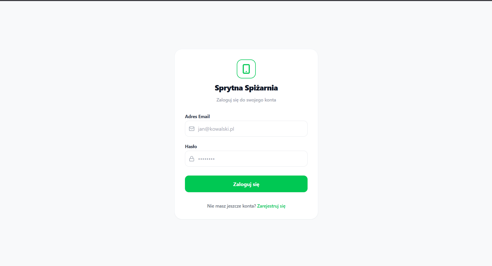
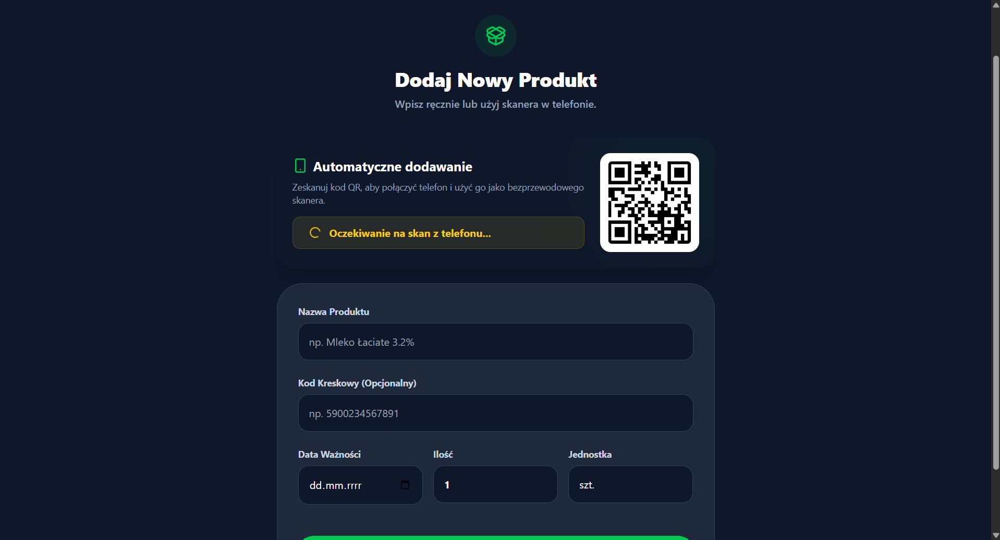
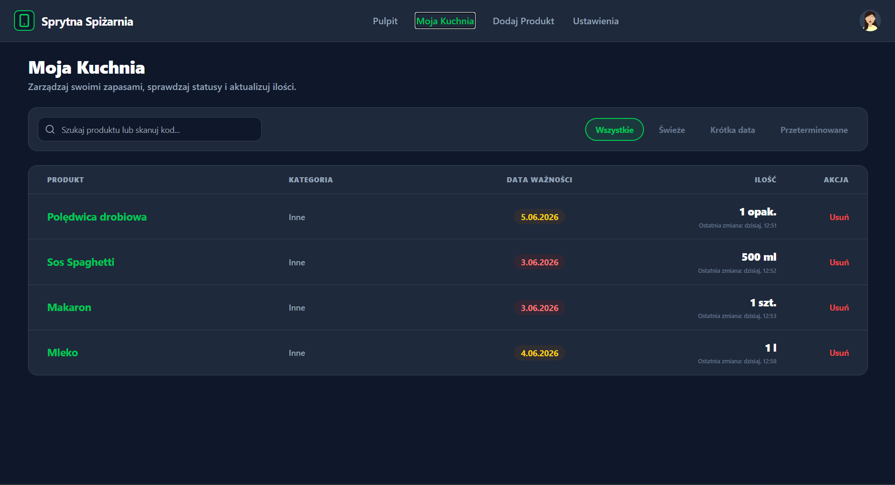
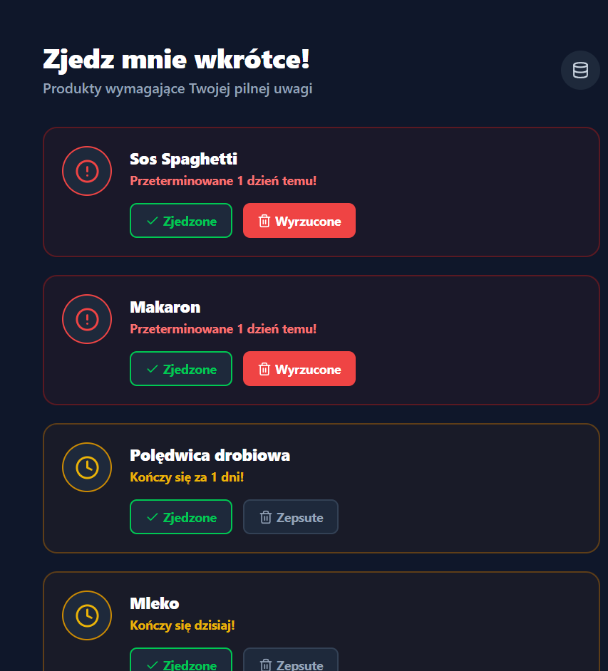
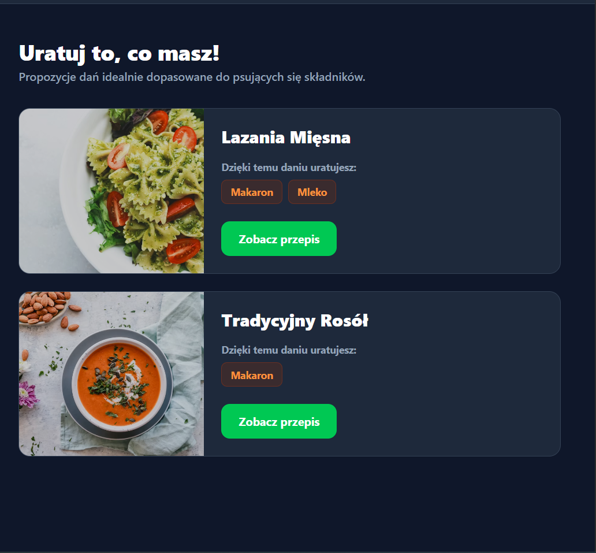
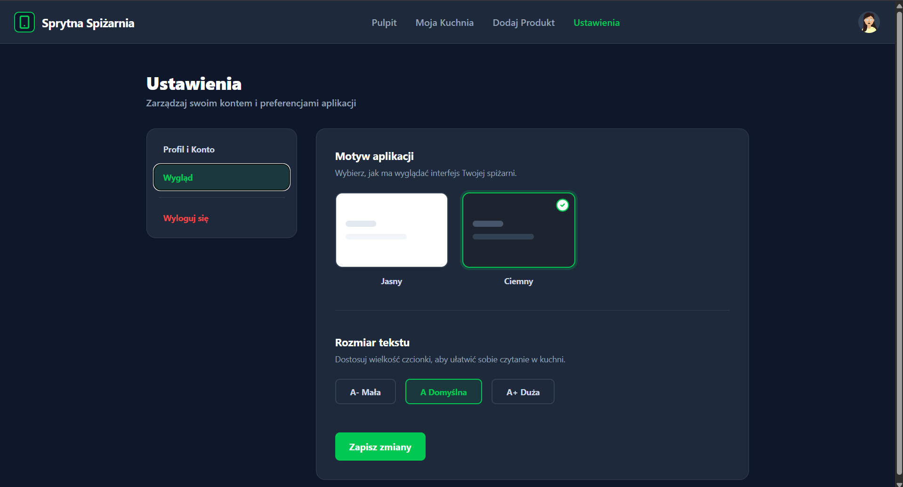

# Sprytna Spiżarnia

**Sprytna Spiżarnia** to webowa aplikacja do zarządzania domowymi zapasami żywności. Umożliwia śledzenie dat ważności produktów, skanowanie kodów kreskowych za pomocą telefonu oraz automatyczne sugestie przepisów dopasowanych do składników, którym kończy się termin przydatności. Aplikacja jest skierowana do każdego, kto chce ograniczyć marnowanie jedzenia i lepiej organizować produkty spożywcze w domu.

**Jaki problem rozwiązuje?**
Aplikacja rozwiązuje problem marnowania jedzenia spowodowany zapominaniem o datach ważności produktów w spiżarni i lodówce. Zamiast wyrzucać przeterminowane produkty, użytkownik jest informowany z wyprzedzeniem i dostaje propozycje przepisów pozwalających je wykorzystać.

**Czym się wyróżnia?**
W przeciwieństwie do zwykłych list zakupów Sprytna Spiżarnia oferuje skanowanie kodów kreskowych przez QR (bez instalowania aplikacji mobilnej), automatyczne pobieranie nazw produktów z globalnej bazy Open Food Facts oraz inteligentne sugestie przepisów posortowane według liczby „ratowanych" składników.

---

## Uruchomienie projektu (developer)

### Użyte technologie

| Technologia                                                                        | Wersja   | Rola                                                |
| ---------------------------------------------------------------------------------- | -------- | --------------------------------------------------- |
| [.NET](https://dotnet.microsoft.com/)                                              | `10.0`   | Backend Web API                                     |
| [ASP.NET Core](https://learn.microsoft.com/en-us/aspnet/core/)                     | `10.0`   | Framework HTTP                                      |
| [Entity Framework Core](https://learn.microsoft.com/en-us/ef/core/)                | `10.0.6` | ORM / migracje bazy danych                          |
| [PostgreSQL](https://www.postgresql.org/)                                          | `16+`    | Relacyjna baza danych (hostowana na Supabase)       |
| [Npgsql](https://www.npgsql.org/)                                                  | `10.0.1` | Sterownik EF Core dla PostgreSQL                    |
| [BCrypt.Net-Next](https://github.com/BcryptNet/bcrypt.net)                         | `4.1.0`  | Hashowanie haseł użytkowników                       |
| [Swashbuckle / Swagger](https://github.com/domaindrivendev/Swashbuckle.AspNetCore) | `10.1.7` | Dokumentacja i testowanie API                       |
| [React](https://react.dev/)                                                        | `19.x`   | Frontend – biblioteka UI                            |
| [Vite](https://vite.dev/)                                                          | `8.x`    | Bundler / serwer deweloperski                       |
| [Tailwind CSS](https://tailwindcss.com/)                                           | `3.4.x`  | Stylowanie komponentów                              |
| [React Router DOM](https://reactrouter.com/)                                       | `7.x`    | Routing po stronie klienta (SPA)                    |
| [Axios](https://axios-http.com/)                                                   | `1.x`    | Klient HTTP do komunikacji z API                    |
| [Lucide React](https://lucide.dev/)                                                | `1.x`    | Biblioteka ikon SVG                                 |
| [html5-qrcode](https://github.com/mebjas/html5-qrcode)                             | `2.3.x`  | Skaner kodów kreskowych w przeglądarce mobilnej     |
| [qrcode.react](https://github.com/zpao/qrcode.react)                               | `4.x`    | Generowanie kodów QR na stronie desktop             |
| [Open Food Facts API](https://world.openfoodfacts.org/data)                        | `v0`     | Globalna baza produktów spożywczych (publiczne API) |
| [DiceBear API](https://www.dicebear.com/)                                          | `7.x`    | Generowanie awatarów użytkowników                   |

### Wymagania programowe

- **System operacyjny**: Windows 10/11, macOS 13+, lub Linux (Ubuntu 22.04+)
- **Środowisko uruchomieniowe / SDK**:
  - [.NET SDK 10.0](https://dotnet.microsoft.com/download/dotnet/10.0) — do uruchomienia backendu
  - [Node.js v20+](https://nodejs.org/) — do uruchomienia frontendu
  - npm `10+` (instalowany razem z Node.js)
- **Baza danych**:
  - Projekt korzysta z [Supabase](https://supabase.com/) (PostgreSQL w chmurze) — **baza jest już skonfigurowana**, nie trzeba instalować PostgreSQL lokalnie.
  - Connection string znajduje się w pliku `SpizarniaAPI/SpizarniaAPI/appsettings.json`.
- **Narzędzia deweloperskie (opcjonalnie)**:
  - [Visual Studio Insiders](https://visualstudio.microsoft.com/) — IDE użyte do tworzenia backendu C#
  - [Visual Studio Code](https://code.visualstudio.com/) — edytor dla frontendu React

### Kroki uruchomienia

#### 1. Klonowanie repozytorium

```bash
git clone <url-repozytorium>
cd Sprytna_Spizarnia
```

#### 2. Uruchomienie backendu (ASP.NET Core)

Można uruchomić przez terminal lub bezpośrednio z **Visual Studio** (przycisk ▶ Run):

```bash
cd SpizarniaAPI/SpizarniaAPI
dotnet run
```

Backend uruchamia się na porcie `5289`. Interaktywna dokumentacja Swagger dostępna pod adresem:
`http://localhost:5289/swagger`

> **Uwaga**: Jeśli chcesz zaktualizować schemat bazy danych, użyj: `dotnet ef database update`

#### 3. Uruchomienie frontendu (React + Vite)

**Tryb standardowy** (tylko przeglądarka na tym samym komputerze):

```bash
cd spizarnia-front
npm install
npm run dev
```

Frontend dostępny pod adresem: `http://localhost:5173`

**Tryb sieciowy** (wymagany do działania skanera QR przez telefon):

Aby telefon w tej samej sieci Wi-Fi mógł otworzyć stronę skanera, frontend musi nasłuchiwać na adresie IP komputera, nie tylko na `localhost`. Wymagane dwa kroki:

1. Uruchom Vite z flagą `--host`, która eksponuje serwer w sieci lokalnej:

```bash
npm run dev -- --host
```

Vite wyświetli adres IP, np.:

```
  ➜  Network: http://192.168.1.15:5173/
```

2. W pliku `src/api.js` zmień `baseURL` z `localhost` na adres IP swojego komputera:

```js
// src/api.js
const api = axios.create({
  baseURL: "http://192.168.1.15:5289/api", // ← adres IP zamiast localhost
});
```

Po tych zmianach kod QR generowany na stronie `/dodaj` będzie zawierał poprawny adres IP, który telefon (w tej samej sieci Wi-Fi) będzie w stanie otworzyć.

> **Ważne**: Backend musi działać przed otwarciem frontendu. Adres IP zmienia się przy każdym połączeniu z siecią — sprawdź aktualny przez `ipconfig` (Windows) lub `ip a` (Linux/macOS).

---

## Architektura systemu

```
┌────────────────────────────────────────────────────────────┐
│                    Przeglądarka (klient)                   │
│  ┌─────────────────────────────────────────────────────┐   │
│  │          React SPA (spizarnia-front / Vite)          │   │
│  │  Routing: React Router DOM                           │   │
│  │  Styl:    Tailwind CSS                               │   │
│  │  HTTP:    Axios → nagłówek X-User-Id (auth)          │   │
│  └─────────────────────────────────────────────────────┘   │
└──────────────────────────┬─────────────────────────────────┘
                           │ HTTP REST (port 5289)
                           ▼
┌────────────────────────────────────────────────────────────┐
│              ASP.NET Core Web API (SpizarniaAPI)            │
│  Controllers/                                               │
│  ├── AuthController       – rejestracja, logowanie, avatar  │
│  ├── PantryController     – spiżarnia (CRUD + logika)       │
│  ├── RecipesController    – sugestie przepisów + seeder     │
│  ├── ScannerController    – relay kodów QR (in-memory)      │
│  ├── CategoriesController – zarządzanie kategoriami         │
│  ├── IngredientsController– zarządzanie składnikami         │
│  └── UsersController      – zarządzanie użytkownikami       │
│  Data/AppDbContext – EF Core DbContext                      │
│  Models/           – encje bazy danych                      │
└──────────────────────────┬─────────────────────────────────┘
                           │ Npgsql / EF Core
                           ▼
┌────────────────────────────────────────────────────────────┐
│               PostgreSQL (Supabase – chmura)                │
│  Tabele: Users, Products, Ingredients, Categories,          │
│          PantryItems, Recipes, RecipeIngredients            │
└────────────────────────────────────────────────────────────┘
```

---

## Diagram encji (ERD)

```
                                                     ┌──────────────────┐
                                                     │    Category      │
                                                     │──────────────────│
                                                     │ Id (int) PK      │
                                                     │ Name             │
                                                     └────────▲─────────┘
                                                              │ * 1
┌──────────────┐        ┌───────────────────┐      ┌─────────┴────────┐
│     User     │ 1    * │    PantryItem      │      │   Ingredient     │
│──────────────│◄───────│───────────────────│      │──────────────────│
│ Id (Guid) PK │        │ Id (Guid) PK       │      │ Id (int) PK      │
│ Email        │        │ UserId (FK→User)   │      │ CategoryId (FK)  │
│ PasswordHash │        │ ProductId (FK)     │      │ Name             │
│ AvatarSeed   │        │ Quantity           │      └──────────▲───────┘
│ CreatedAt    │        │ Unit               │                 │
└──────┬───────┘        │ ExpirationDate     │                 │ * 1
       │                │ CreatedAt          │      ┌──────────┴───────────┐
       │                │ UpdatedAt          │  *1  │      Product         │
       │                └──────────┬─────────┘─────►│──────────────────────│
       │                           │                │ Id (int) PK          │
       │                           │                │ IngredientId (FK)    │
       └───────────────────────────┼───────────────►│ Name                 │
                  FK→User          │                │ Barcode (unique)     │
                                   │                │ UserId (FK→User)     │
                                   │                └──────────────────────┘
                                   │
┌─────────────────┐        ┌───────┴──────────────────┐
│     Recipe      │ 1    * │     RecipeIngredient      │
│─────────────────│◄───────│──────────────────────────│
│ Id (int) PK     │        │ Id (int) PK               │
│ Title           │        │ RecipeId (FK→Recipe)      │
│ Instructions    │        │ IngredientId (FK→Ingr.)   │
│ PrepTimeMinutes │        │ Quantity                  │
└─────────────────┘        │ Unit                      │
                           └───────────────────────────┘
```

> Encja `Ingredient` jest współdzielona przez oba konteksty: produkt w spiżarni wskazuje na składnik przez `Product.IngredientId`, a przepis wskazuje na składnik przez `RecipeIngredient.IngredientId`. Dzięki temu system może dopasowywać produkty użytkownika do przepisów.

---

## Struktura projektu

```
Sprytna_Spizarnia/
│
├── SpizarniaAPI/                        # Backend (C# / ASP.NET Core)
│   └── SpizarniaAPI/
│       ├── Controllers/
│       │   ├── AuthController.cs        # POST /api/auth/register, login, PUT avatar
│       │   ├── PantryController.cs      # GET/POST/PUT/DELETE /api/pantry
│       │   ├── RecipesController.cs     # GET /api/recipes/suggestions, POST seed
│       │   ├── ScannerController.cs     # GET/POST /api/scanner/{sessionId}
│       │   ├── CategoriesController.cs  # CRUD /api/categories
│       │   ├── IngredientsController.cs # CRUD /api/ingredients
│       │   └── UsersController.cs       # CRUD /api/users
│       ├── Data/
│       │   └── AppDbContext.cs          # EF Core kontekst + konfiguracja relacji
│       ├── Migrations/                  # Migracje EF Core (historia schematu bazy)
│       ├── Models/
│       │   ├── Category.cs
│       │   ├── Ingredient.cs
│       │   ├── PantryItem.cs
│       │   ├── Product.cs
│       │   ├── Recipe.cs
│       │   ├── RecipeIngredient.cs
│       │   └── User.cs
│       ├── Program.cs                   # Konfiguracja DI, CORS, pipeline HTTP
│       ├── appsettings.json             # Connection string do Supabase
│       └── SpizarniaAPI.csproj
│
└── spizarnia-front/                     # Frontend (React + Vite)
    └── src/
        ├── api.js                       # Axios z interceptorem X-User-Id
        ├── App.jsx                      # Routing + ProtectedRoute
        ├── components/
        │   ├── Navbar.jsx               # Nawigacja z awatarem DiceBear
        │   ├── AddProductModal.jsx      # Modal dodawania produktu
        │   └── MobileScanner.jsx        # Widok aparatu na urządzeniu mobilnym
        ├── pages/
        │   ├── LoginPage.jsx            # Logowanie / rejestracja
        │   ├── DashboardPage.jsx        # Pulpit – alerty + sugestie przepisów
        │   ├── PantryPage.jsx           # Lista spiżarni z filtrowaniem i edycją
        │   ├── AddProductPage.jsx       # Formularz + skaner QR
        │   ├── SettingsPage.jsx         # Ustawienia konta, awatara i wyglądu
        │   └── RecipesPage.jsx          # Strona przepisów (w budowie)
        ├── index.css
        └── main.jsx
```

## Cykl życia i ekrany aplikacji (Use Cases)

Aplikacja Sprytna Spiżarnia oferuje pełny cykl życia użytkownika od rejestracji, przez dodawanie i zarządzanie zapasami, aż po wykorzystanie produktów w sugerowanych przepisach.

### 1. Logowanie i rejestracja (`/login`)


Ekran startowy. Formularz z polem e-mail i hasłem obsługuje dwa tryby: **Zaloguj się** i **Zarejestruj się** (przełączane jednym przyciskiem). Po zalogowaniu API zwraca `userId`, który zapisywany jest w `localStorage`. Każde kolejne żądanie HTTP dołącza ten identyfikator w nagłówku `X-User-Id`.

### 2. Dodaj Produkt (`/dodaj`)


Dwa sposoby dodania produktu:
1. **Ręcznie** – formularz z polami: Nazwa, Kod kreskowy (opcjonalnie), Data ważności, Ilość, Jednostka (szt./kg/g/l/ml/opak.)
2. **Skaner mobilny** – kliknięcie „Uruchom skaner w telefonie" generuje sesję i kod QR. Zeskanowanie go telefonem otwiera widok `/scan/:sessionId` z kamerą. Zeskanowany kod kreskowy trafia do `POST /api/scanner/{sessionId}`. Strona desktop odpytuje `GET /api/scanner/{sessionId}` co 1,5 s. Po wykryciu kodu aplikacja pobiera dane z Open Food Facts i uzupełnia formularz.

### 3. Moja Kuchnia (`/kuchnia`)


Pełna tabela wszystkich produktów w spiżarni danego użytkownika. Funkcjonalności:
- **Wyszukiwarka** po nazwie
- **Filtry statusu**: Wszystkie / Świeże / Krótka data (≤3 dni) / Przeterminowane
- **Usuwanie** przyciskiem „Usuń" (`DELETE /api/pantry/{id}`)

### 4. Pulpit: Alerty i Przepisy ratunkowe (`/`)



Główny ekran podzielony na dwie kolumny:
- **Zjedz mnie wkrótce! (Lewa strona)** – alerty o produktach przeterminowanych (czerwone karty) i kończących się w ciągu 3 dni (żółte karty). Przyciski „Zjedzone" i „Wyrzucone" usuwają produkt ze spiżarni przez `DELETE /api/pantry/{id}`.
- **Uratuj to, co masz! (Prawa strona)** – propozycje przepisów pobierane z `GET /api/recipes/suggestions`, posortowane malejąco wg liczby „ratowanych" składników. Kliknięcie "Zobacz przepis" pozwala przejść do szczegółów przygotowania i uratować żywność.

### 5. Ustawienia (`/ustawienia`)


Dwie zakładki w bocznym menu:
- **Profil i Konto**: wyświetlanie e-maila (read-only), wybór awatara z galerii (zapisywany przez `PUT /api/auth/avatar`), pola zmiany hasła.
- **Wygląd**: przełącznik motywu (jasny/ciemny) i rozmiaru tekstu (mała/domyślna/duża). Preferencje zapisywane w `localStorage` i natychmiast stosowane do całej aplikacji.

---

## Endpointy API

Pełna interaktywna dokumentacja dostępna przez **Swagger UI** pod `http://localhost:5289/swagger` w trybie deweloperskim.

### Autoryzacja

Każdy endpoint (poza `/api/auth/*`) wymaga nagłówka HTTP:

```
X-User-Id: <uuid-użytkownika>
```

### Tabela endpointów

| Metoda   | Ścieżka                    | Kontroler               | Opis                                                    |
| -------- | -------------------------- | ----------------------- | ------------------------------------------------------- |
| `POST`   | `/api/auth/register`       | `AuthController`        | Rejestracja – hasło hashowane BCrypt                    |
| `POST`   | `/api/auth/login`          | `AuthController`        | Logowanie – zwraca `userId`, `email`, `avatarSeed`      |
| `PUT`    | `/api/auth/avatar`         | `AuthController`        | Zmiana awatara zalogowanego użytkownika                 |
| `GET`    | `/api/pantry`              | `PantryController`      | Lista produktów w spiżarni (filtr po userId)            |
| `POST`   | `/api/pantry`              | `PantryController`      | Dodaj produkt (auto-tworzy Product/Ingredient/Category) |
| `PUT`    | `/api/pantry/{id}`         | `PantryController`      | Aktualizuj produkt w spiżarni                           |
| `DELETE` | `/api/pantry/{id}`         | `PantryController`      | Usuń produkt z spiżarni                                 |
| `GET`    | `/api/recipes/suggestions` | `RecipesController`     | Przepisy dla psujących się składników                   |
| `POST`   | `/api/recipes/seed`        | `RecipesController`     | Wgraj ~100 przykładowych przepisów do bazy              |
| `GET`    | `/api/scanner/{sessionId}` | `ScannerController`     | Odbierz zeskanowany kod (polling)                       |
| `POST`   | `/api/scanner/{sessionId}` | `ScannerController`     | Zapisz zeskanowany kod (z telefonu)                     |
| `GET`    | `/api/categories`          | `CategoriesController`  | Lista kategorii                                         |
| `POST`   | `/api/categories`          | `CategoriesController`  | Dodaj kategorię                                         |
| `PUT`    | `/api/categories/{id}`     | `CategoriesController`  | Aktualizuj kategorię                                    |
| `DELETE` | `/api/categories/{id}`     | `CategoriesController`  | Usuń kategorię                                          |
| `GET`    | `/api/ingredients`         | `IngredientsController` | Lista składników                                        |
| `POST`   | `/api/ingredients`         | `IngredientsController` | Dodaj składnik                                          |
| `PUT`    | `/api/ingredients/{id}`    | `IngredientsController` | Aktualizuj składnik                                     |
| `DELETE` | `/api/ingredients/{id}`    | `IngredientsController` | Usuń składnik                                           |
| `GET`    | `/api/users`               | `UsersController`       | Lista użytkowników                                      |
| `GET`    | `/api/users/{id}`          | `UsersController`       | Pobierz użytkownika po ID                               |
| `PUT`    | `/api/users/{id}`          | `UsersController`       | Aktualizuj użytkownika                                  |
| `DELETE` | `/api/users/{id}`          | `UsersController`       | Usuń użytkownika                                        |

---

## Logika biznesowa – kluczowe algorytmy

### Dodawanie produktu do spiżarni (POST /api/pantry)

Endpoint stosuje strategię **find-or-create** na kilku poziomach:

1. Szuka `Product` po nazwie (case-insensitive). Jeśli nie istnieje:
2. Szuka `Ingredient` po nazwie. Jeśli nie istnieje:
3. Szuka `Category` o nazwie „Inne". Jeśli nie istnieje – tworzy ją.
4. Tworzy `Ingredient` z tą kategorią.
5. Tworzy `Product` z kodem kreskowym (lub `"BRAK-{timestamp}"` jeśli brak).
6. Tworzy `PantryItem` przypisany do użytkownika.

### Sugestie przepisów (GET /api/recipes/suggestions)

1. Pobiera `IngredientId` wszystkich produktów użytkownika z datą ważności ≤ dzisiaj + 3 dni.
2. Wyszukuje przepisy (`Recipe`), które zawierają **przynajmniej jeden** z tych składników.
3. Dla każdego przepisu oblicza listę „ratowanych" składników (przecięcie).
4. Zwraca przepisy posortowane **malejąco** wg liczby ratowanych składników.

### Skanowanie mobilne (ScannerController)

Używa `ConcurrentDictionary<string, string>` przechowywanego **w pamięci procesu** (in-memory). Klucz to `sessionId` (5-znakowy kod alfanumeryczny). Telefon wysyła kod `POST`, desktop odbiera i usuwa go przez `GET`. Nie wymaga bazy danych ani WebSocketów.

---

## Bezpieczeństwo

- **Hasła** hashowane algorytmem BCrypt (biblioteka `BCrypt.Net-Next 4.1.0`). Surowe hasło nigdy nie jest zapisywane w bazie.
- **Autoryzacja** oparta o nagłówek `X-User-Id` (UUID). Każdy endpoint spiżarni filtruje dane tylko dla podanego userId.
- **CORS** skonfigurowany z `AllowAnyOrigin` (dla środowiska deweloperskiego).

> **Uwaga**: Mechanizm `X-User-Id` jest uproszczony na potrzeby projektu akademickiego. W środowisku produkcyjnym należy zastosować JWT (JSON Web Tokens) lub inny standard tokenów.

---

## Znane ograniczenia i plany rozwoju

- Strona przepisów (`RecipesPage.jsx`) jest w trakcie budowy – komponent nie zawiera jeszcze treści
- Zmiana hasła widoczna w UI ustawień, ale endpoint backendowy nie jest zaimplementowany
- Nawigacja mobilna (hamburger menu) nie jest zaimplementowana – linki Navbar są ukryte na małych ekranach
- `ScannerController` przechowuje kody w pamięci procesu – restart serwera kasuje oczekujące sesje skanowania
- Kategorie produktów w widoku Moja Kuchnia wyświetlane są statycznie jako „Inne"
